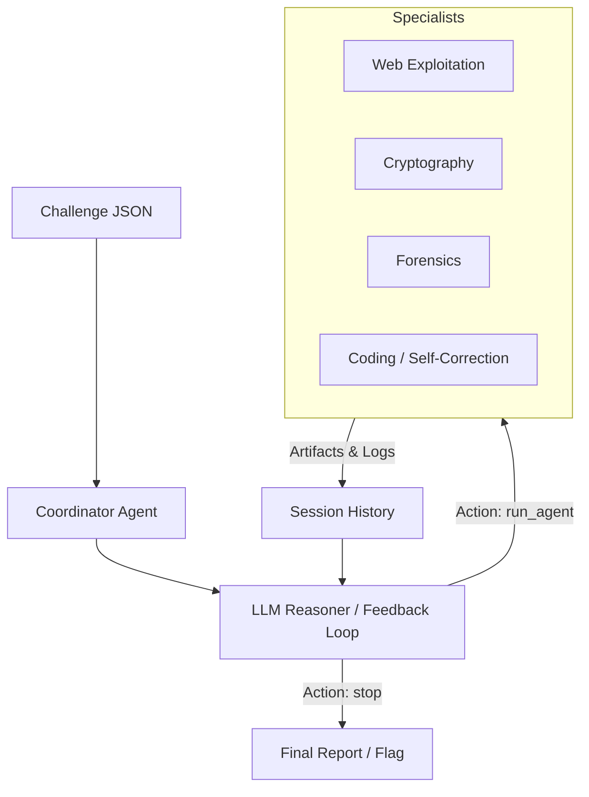

# CTF_Agents: Autonomous Security Operations

**CTF_Agents** is an advanced, iterative multi-agent system designed to autonomously solve Capture The Flag (CTF) challenges. Unlike traditional linear scanners, this system uses an **iterative feedback loop** to reason about artifacts, execute complex tools, and adapt its strategy in real time.

## 🔥 Demo

Example: Web → Forensics → Coding → Flag extraction (2 iterations)

**[ROUTER]** target=web_agent action=run_agent  
→ *Found embedded artifact*

**[ROUTER]** target=forensics_agent action=run_agent  
→ *Extracted data via binwalk/strings*

**[ROUTER]** target=coding_agent action=run_agent  
→ *Generated script → executed → corrected*

✅ **Flag recovered:** `HTB{iterative_forensics_master}`

This fork extends the original architecture with standardized tool execution, iterative coordination, deep forensics capabilities, and self-correcting code execution.

---

## 🧠 TL;DR
An iterative, multi-agent CTF system that reasons → acts → observes → adapts → solves (iteratively).

---

## 🚀 Key Innovations

### 1. Iterative Feedback Loop (`Propose → Execute → Refine`)
The `CoordinatorAgent` no longer performs one-shot routing. It maintains a persistent session history and continuously evaluates results from each step.
*   **Context-Aware**: Outputs from one agent directly inform the next (e.g., Web recon scan → Crypto decoding → Forensics extraction).
*   **Adaptive Reasoning**: Uses real execution results (stdout, artifacts, errors) to guide dynamic strategy pivots.
*   **Bounded Autonomy**: Intelligent iteration limits ensure the agent exhausts logical paths without entering infinite loops.

### 2. Self-Correcting Coding Agent
A specialized specialist that generates and executes Python scripts for solving dynamic problems.
*   **Auto-Correction**: Failed scripts are analyzed using `stdout`/`stderr` and automatically refined by the LLM for a retry.
*   **Context-Aware Fixes**: Workspace files and previous execution results are fed back into the reasoning loop to ensure high-quality fixes.
*   **Controlled Execution**: Runs inside a standardized `PythonTool` environment with strict timeouts and safeguards.

### 3. Deep Forensics & Artifact Extraction
Integrated forensic workflow using a unified tool interface for hidden data discovery:
*   **Binwalk**: Automated file signature and embedded artifact analysis.
*   **ExifTool**: Comprehensive metadata extraction and hidden field detection.
*   **Strings**: Intelligent extraction of printable data from binaries.

### 4. Universal Flag Detection
Centralized detection logic in `core/utils/flag_utils.py` capable of identifying diverse flag formats:
*   ✅ `CTF{...}`
*   ✅ `HTB{...}`
*   ✅ Custom prefixed patterns across all tool outputs and script results.

---

## 🏗️ Architecture



---

## 🛠️ Standardized Tool Layer
All external tools run through a unified `BaseTool` interface, providing:
*   **Structured Outputs**: Consistent access to stdout, exit codes, and execution metadata.
*   **Safety Controls**: Centralized timeout handling and bounded logging to keep operations sane.
*   **Extensible**: Easily integrate new tools like `sqlmap`, `nmap`, or `ghidra` by extending `BaseTool`.

---

## 🔥 What Makes This Different?

Most "AI agent" systems stop after one step:
> call LLM → run tool → stop

**This system follows a circular evolution:**
> reasons → acts → observes → adapts → solves

---

## 🚦 Getting Started

### Prerequisites
*   Python 3.10+
*   Standard CTF tools installed in your `PATH`: `binwalk`, `exiftool`, `strings`, `nmap`.
*   OpenAI API Key (configured in `config/.env`).

### Installation
```bash
git clone https://github.com/YOUR_USERNAME/CTF_Agents.git
cd CTF_Agents
python3 -m venv .venv
source .venv/bin/activate
pip install -r requirements.txt
```

### Running a Challenge
```bash
# Run the automated solver
python main.py challenges/templates/example_web_challenge.json

# Run the end-to-end simulation test
python simulate_v2.py
```

---

## 🧪 Testing
The system includes an exhaustive test suite covering iterative logic and tool consistency.
```bash
pytest tests/unit/
```
Includes coverage for: iterative coordination, reasoning logic, tool execution consistency, and agent behavior.

---

## 🔒 Security & Ethics
This system is intended for **authorized CTF competitions**, **security research**, and **educational use**. 
**Do not use against live systems without explicit, written permission.**

---

## 🙏 Acknowledgments
*   Original architecture by **TonyZeroArch**.
*   Built for the global CTF and AI Security research community.
