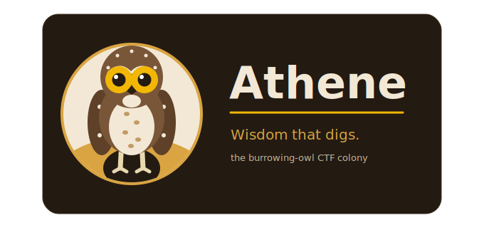

<p align="center">
  
</p>

<p align="center"><em>An iterative, multi-agent system that reasons &rarr; acts &rarr; observes &rarr; adapts &rarr; solves CTF challenges.</em></p>

<p align="center">
  
  
  
  
</p>

> **Athene** — *Athene cunicularia*, the burrowing owl. Genus named for Athena, goddess of wisdom and strategic warfare, whose emblem has been the owl for millennia. The burrowing owl is the one that lives underground, repurposes burrows dug by others, hunts from a colony, and digs in deep. Fitting, for a tool that forks an architecture, runs a colony of agents, and tunnels through whatever you point it at.

---

## What is Athene?

Athene is an advanced, iterative multi-agent system that autonomously solves Capture The Flag (CTF) challenges. Unlike a linear scanner, it runs a feedback loop: it reasons about artifacts, executes real tools, observes the results, and adapts its strategy in real time until a flag surfaces.

You talk to it in plain English. A router — the **Lookout** — figures out what you want, finds the files you mentioned, and wakes the right specialist.

```bash
# Reverse engineering: analyze logic, then verify by running it
python3 ask.py "Find a password for ~/Downloads/PYTHON1.py"

# Password cracking
python3 ask.py "Decrypt hash 68a96446a5afb4ab69a2d15091771e39 using my_passwords.txt"
```

```
[ROUTER] target=reverse_agent action=run_agent
  -> Extracted constraints: Sum=1000, Length=10, Index 1='S'
  -> Derived candidate: mSeeeeeeee
  -> Executing PYTHON1.py mSeeeeeeee...
VERIFICATION SUCCESS: program returned 'correct'
```

---

## The colony

Each agent is a **sentry** guarding one kind of burrow. See [`docs/COLONY.md`](docs/COLONY.md) for the full lore and naming convention.

| Sentry | Role | What it digs with |
|---|---|---|
| **The Lookout** | Routing | Intent parsing, file/path detection, auto-categorization |
| **The Digger** | Reverse engineering | Static analysis, constraint solver, live-execution verification |
| **The Prowler** | Web | Playwright recon, dirsearch, sqlmap, login-bypass + `parseInt()` octal-bug detection |
| **The Cracker** | Crypto | Hashcat, John, dictionary + raw-md5, wordlist auto-detection |
| **The Sifter** | Forensics | Binwalk, ExifTool, Strings, QPDF |
| **The Tinkerer** | Coding | Generates + runs Python, self-corrects crashing scripts |
| **The Scout** | OSINT | Metadata extraction, domain harvesting |
| **The Watcher** | Log analysis | Brute-force + statistical anomaly detection |
| **The Listener** | Network forensics | Scapy deep-packet inspection, custom TCP/UDP stream reconstruction |

---

## Key features

**Natural-language entry (`ask.py`).** Type what you want. Athene detects filenames and paths (including `~/`), maps the task to Web / Crypto / Forensics / Reverse / OSINT / Logs / Network, and falls back to reliable heuristics even without an LLM API key.

**Flag-format aware.** Native support for NCL Cyber Skyline (`SKY-XXXX-####`) and Hack The Box (`HTB{...}`) patterns, with session-authenticated browser snapshots. Centralized detection catches flags across every tool's output, logs, and artifacts.

**Standardized tool + result layer.** Every tool implements a unified `BaseTool` interface with strict timeouts and safety boundaries. A result manager persists findings to `results/{challenge_id}/` with dedicated folders for reports, artifacts, and flags (and auto-cleans to the 5 most recent runs).

**Automated web exploitation.** Heuristic SQLi and cookie manipulation (`admin=true`), a logic-flaw engine that detects `parseInt()` octal bugs in leaked JS, and high-speed discovery of common CTF leaks (`.env`, `.git/config`, backups).

---

## Quickstart

### Prerequisites

- Python 3.10+
- Security tools on `PATH`: `hashcat`, `john`, `binwalk`, `exiftool`, `strings`, `qpdf`, `nmap`
- *(Optional)* an LLM API key in `.env` for advanced reasoning

### Install

```bash
git clone https://github.com/rmjohnson12/Athene.git
cd Athene
python3 -m venv .venv
source .venv/bin/activate
pip install -r requirements.txt
```

### Launch banner (optional)

Drop [`athene_banner.py`](athene_banner.py) into the project root and call it at startup:

```python
from athene_banner import banner
banner(version="2.0", sentries=8)
```

```
  ╭───────╮
  │ ◉   ◉ │     A T H E N E
  │  ╲╱   │     ──────────────────────────────────
  ╰──┬─┬──╯     wisdom that digs
     ╱ ╲        the burrowing-owl CTF colony
    ╱   ╲       v2.0  ·  colony online ▸ 8 sentries ready
```

It respects `NO_COLOR` and only colorizes a real TTY.

---

## Testing

```bash
pytest tests/unit/
```

---

## Security & ethics

Athene is for **authorized CTF competitions**, **security research**, and **education**. Do not use it against systems you do not own or have explicit, written permission to test.

---

## Credits & license

Original architecture by **[TonyZeroArch](https://github.com/TonyZeroArch/CTF_Agents)**; Athene is a rebrand and continuation of that work. Built for the CTF and AI-security community.

Released under the **MIT License** — see [`LICENSE`](LICENSE).
